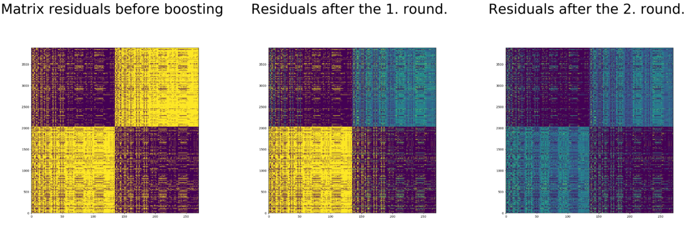

L-EnsNMF and BoostedNE
============================================
<p align="justify">
The factorization procedure L-EnsNMF creates a sequential ensemble factorization of a target matrix. In each factorization round a residual target matrix is created by sampling an anchor row and column. Anchor sampling finds a block of matrix entries that are similar to the row and column and other entries of the residual matrix are downsampled. By factorizing the residuals matrices each relatively upsampled block gets a high quality representation. BoostedNE adapts this idea for node embedding. An approximate target matrix obtained with truncated random walk sampling is factorized by the L-EnsNMF method. This way blocks of highly connected nodes get representations that are described by vectors obtained in a given boosting round. Specifically, my implementation assumes that the target matrices are sparse. So far this is the only publicly available Python implementation of these procedures.
</p>
<p align="center">
  
</p>


This repository provides an implementation for L-EnsNMF and BoostedNE as described in the papers:

> L-EnsNMF: Boosted Local Topic Discovery via Ensemble of Nonnegative Matrix Factorization
> Sangho Suh, Jaegul Choo, Joonseok Lee, Chandan K. Reddy
> ICDM, 2016.
> http://dmkd.cs.vt.edu/papers/ICDM16.pdf

> Multi-Level Network Embedding with Boosted Low-Rank Matrix Approximation.
> Jundong Li, Liang Wu and Huan Liu
> ICDM, 2018.
> https://arxiv.org/abs/1808.08627

### Requirements

The codebase is implemented in Python 2.7. package versions used for development are just below.
```
networkx          1.11
tqdm              4.19.5
numpy             1.13.3
pandas            0.20.3
texttable         1.2.1
scipy             1.1.0
argparse          1.1.0
sklearn           0.19.1
```

### Datasets

#### Graphs

The code takes an input graph in a csv file. Every row indicates an edge between two nodes separated by a comma. The first row is a header. Nodes should be indexed starting with 0. A sample graph for the `Wikipedia Giraffes` is included in the `input/` directory.

#### Sparse Matrices

The code takes an input matrix in a csv file. Every row indicates a (user,item,score) separated by a comma. The first row is a header. Users and items should be indexed starting with 0, each score is positive. A sample sparse stochastic block matrix is included in the  `input/` folder.

### Options

Learning of the embedding is handled by the `src/main.py` script which provides the following command line arguments.

#### Input and output options

```
  --input-path STR        Edges path.                        Default is `input/giraffe_edges.csv`.
  --output-path STR       Embedding path.                    Default is `output/giraffe_embedding.csv`.
  --dataset-type STR      Whether the dataset is a graph.    Default is `graph`.  
```

#### Boosted Model options

```
  --dimensions INT         Number of embeding dimensions.   Default is 8.
  --iterations INT         Number of power interations.     Default is 10.
  --alpha FLOAT            Regularization coefficient.      Default is 0.001.
```

#### DeepWalk options

```
  --number-of-walks INT         Number of random walks.                  Default is 10.
  --walk-length INT             Random walk length.                      Default is 80.
  --window-size INT             Window size for feature extractions.     Default is 3.
  --pruning-threshold INT       Minimal co-occurence count to be kept.   Default is 10.
```

### Examples

The following commands learn a graph embedding and write the embedding to disk. The node representations are ordered by the ID.

Creating an embedding of the default dataset with the default hyperparameter settings. Saving the embedding at the default path.

```
python src/main.py
```
Creating an embedding of the default dataset with 16 dimensions and 20 boosting rounds. This results in a 16x20=320 dimensional embedding.

```
python src/main.py --dimensions 16 --iterations 20
```

Creating an FSCNMF embedding of the default dataset with stronger regularization.

```
python src/main.py --alpha 0.1
```

Creating an embedding of an other dataset the `Wikipedia Dogs`. Saving the output in a custom folder.

```
python src/main.py --input-path input/dog_edges.csv --output-path output/dog_fscnmf.csv
```

Creating an embedding of the default dataset with 20 random walks per source and 120 nodes in each vertex sequence.

```
python src/main.py --walk-length 120 --number-of-walks 20
```

Creating an embedding of a non-graph dataset and storing it under a non-standard name.

```
python src/main.py --dataset-type sparse --input-path input/small_block.csv --output-path output/block_embedding.csv
```
